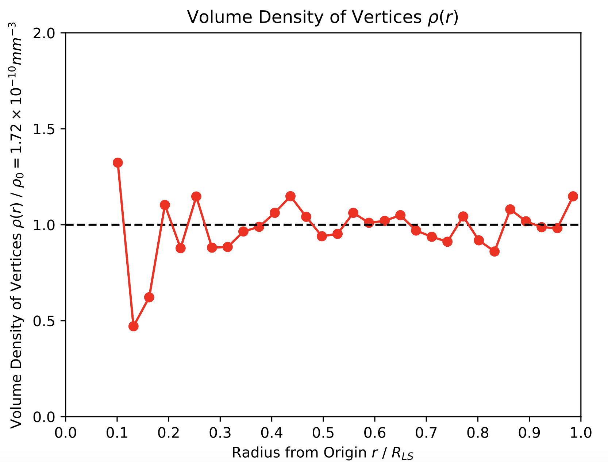
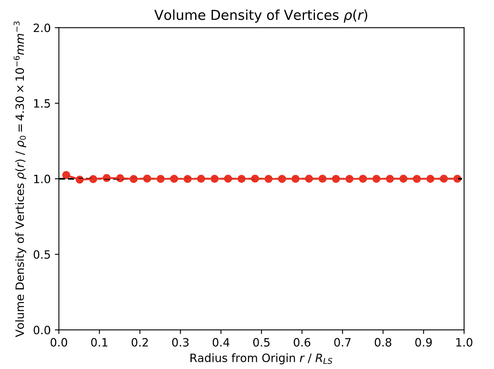

# JUNO模拟与分析实验报告

**Team: PMTSmasher**

**Members: 沈若寒 刘明昊 赵海萌**

**小组主要分工：**

- 沈若寒：光学过程
- 刘明昊：顶点模拟与光子生成
- 赵海萌：绘图与波形生成

## 目录

[TOC]

## 整体思路

Lmh

## 1. 顶点模拟与光子生成

Lmh

### 1.1. 思路

此为模板，可任意修改！

### 1.2. 算法


### 1.3. 主要实现方式


### 1.4. 遇到的问题与解决办法


## 2. 光学过程

srh

## 3. 绘图

### 3.1. 思路

**绘图** 是相对较为独立的一项功能，且具有与其余代码交叉验证的功能，因此我们在项目初期建立了 *Git Branch* **draw** 完成了该功能的初步实现。在使用 *GhostHunter 2021* 的数据集简单检验了代码的正确性后，我们将其应用于辅助验证及调试项目其余功能的实现情况。在顶点模拟与光学过程的功能完成后，我们利用完整生成的data.h5对绘图功能进行了进一步地调整和优化：重构了代码结构，调整了图表外观，利用插值增加了图标的分辨率，使其更易阅读。

具体来说，绘图功能包括三个部分：

- **函数 ```draw_vertices_density```** : 绘制顶点体密度随半径分布的图像，用于验证所生成的顶点是否符合均匀体密度分布的要求；
- **函数 ```draw_pe_hit_time```** : 绘制光电子接收时间的直方图，用于展示电子在液闪中激发的光子传播到PMT上所产生的光电子在时间上的分布情况；
- **函数 ```draw_probe```** : 绘制每个 PMT 对探测器内任意⼀点处顶点激发所产生的光子中，被该PMT接收到的光⼦产⽣的 PE 的电荷数期望（以后简称 *Probe* 函数）的极坐标分布图，用于展示光学过程对光子接受概率分布的影响。

### 3.2. 主要实现方式

下面分别对这三个功能的具体实现方式和结果做一个介绍。

#### 3.2.1. 顶点体密度分布图

顶点体分布图的绘制较为简单：从 **ParticleTruth** 表中读出各顶点的直角坐标 $(x, y, z)$ ，计算得到其与原点的距离  $r = \sqrt{x^2+y^2+z^2}$ ，再利用绘制直方图的函数 ```plt.hist``` 得到顶点数随半径的分布，最后根据
$$
\rho(r) = \frac{\text{d}N}{\text{d}V} = \frac{\text{d}N}{\frac{4\pi}{3}\text{d}(r^3)}
$$
计算得到顶点体密度随半径的分布，并绘制成图。在绘图过程中，为了美观，我们将纵坐标体密度的单位设置成预期的均匀体密度 $\rho_0 = \frac{N}{V} \approx 1.72\times 10^{-10} \text{mm}^{-3}$ ，并在 $\rho/\rho_0 = 1$ 处绘制了参考线，使该图更易阅读，最终得到的样图如下图所示，可以看到生成的顶点在随机误涨落范围内大致复合均匀分布的要求。



**注意！** 在进行体密度修正时，不要使用 $\text{d}V = 4\pi r^2\text{d}r$ 的近似，否则会导致在顶点数较少的地方出现与真实体密度相差甚远的偏差，使用$ \Delta V = V_2-V_1 = \frac{4\pi}{3}r_2^3-\frac{4\pi}{3}r_1^3 $ ，并将 ```plt.hist``` 返回的半径 ```bins``` 取平均后作为横坐标，可以有效避免这一问题。

我们注意到，根据大数定律，顶点数密度的涨落会随着顶点数的增加而趋于消失。为了验证我们程序的正确性，我们使用同样的程序在顶点数为 $10^{8}$ 时进行了模拟，得到的顶点数分布如下图所示。可以看到顶点的体密度分布非常均匀！符合我们的预期。



#### 3.2.2. 光电子接收时间直方图


#### 3.2.3. Probe函数图


## 4. 波形生成


## 5. 优化经验总结


## 6. 加分项目

